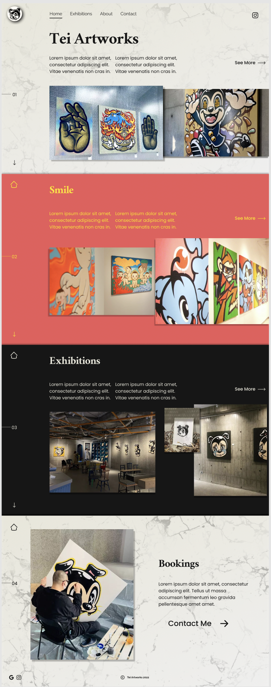

# Tei Artworks React Single Page Landing

## Table of contents

- [Overview](#overview)
  - [The challenge](#the-challenge)
  - [Screenshot](#screenshot)
  - [Links](#links)
- [My process](#my-process)
  - [Built with](#built-with)
  - [What I learned](#what-i-learned)
  - [Useful resources](#useful-resources)
- [Author](#author)

## Overview

This is a desktop website for a business called Tei Artworks organized by a Japan based artist Kobe. It was designed and developed to be interactive and engaging in order to hold the attention of users and encourage them to keep exploring. .

Special thanks to [Dillon Chhit](https://www.linkedin.com/in/dillon-chhit-8b0328222/) for the awesome design, invaluable input, and well organized figma project.

### The challenge

- Develop a React landing page designed by one of our fellow UX design apprentices.

### Designs

[Figma Project Here](https://www.figma.com/proto/sSHw35ZtGJ4dqzow2skAkk/Artist-Project?node-id=2%3A371&scaling=scale-down-width&page-id=0%3A1&starting-point-node-id=2%3A371)

### Links

- Solution URL: [https://github.com/OxanaSF/tei-artworks](https://github.com/OxanaSF/tei-artworks)

## My process

### Built with

- Semantic HTML5 markup
- CSS Flex Box
- CSS Grid
- [React](https://reactjs.org/)
- [Styled Components](https://styled-components.com/)

### Useful resources

- [React](https://reactjs.org/)
- [Styled Components](https://styled-components.com/)

## Author

- Oxana Howard - Developer
  - [Website](https://github.com/OxanaSF)
  - [Linkedin](https://www.linkedin.com/in/oxana-howard/)
- Dillon Chhit - Designer
  - [Linkedin](https://www.linkedin.com/in/dillon-chhit-8b0328222/)

  